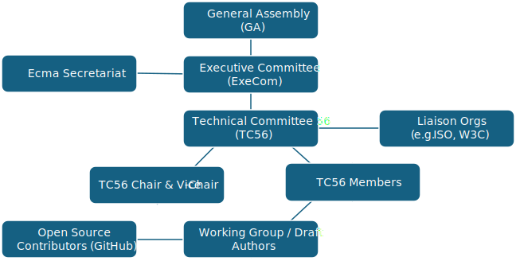

# GOVERNANCE

## Overview

This repository is governed by **Ecma International Technical Committee 56 (TC56)** under the rules and processes of [Ecma International](https://www.ecma-international.org). The goal is to provide transparent, inclusive, and pragmatic governance for the development of the **Natural Language Interaction Protocol (NLIP)** and related specifications.

## Background

Flexibility, reactivity and pragmatic rules are the keys to quickly and successfully produce a Standard or a Technical Report which meets the needs of the market and the industry. Initiation of new standardization work at Ecma is simple and fast and a technical committee (TC) to study a new topic can be easily setup.

In addition, cooperation with Open Source projects in a Royalty Free environment and collaboration with other formal SDOs such as ISO, IEC, JTC 1, ITU-T and IETF demonstrates the high quality level of Ecma’s Standards which are widely trusted in the technological world.

## Open Governance Principles for Ecma TC56 NLIP

We adhere to the following core principles:
- **Open Participation**: Stakeholders from academia, industry, and open-source communities are welcome.
- **Fast Iteration**: We optimize for speed and clarity in decision-making while maintaining consensus.
- **Royalty-Free Implementation**: All specifications are designed to be implementable in open-source or commercial projects under royalty-free terms.
- **Interop with Open Source**: Specifications are interoperable with existing open-source ecosystems and protocols.
- **Respectful Conduct**: We follow the Contributor Covenant Code of Conduct in all project spaces.

---

## ECMA Governance Structure

### Technical Committee 56 (TC56)
NLIP is developed under **TC56**, a formal ECMA technical committee.

- **Chair**: Nominated by TC members, provisionally approved by ECMA Executive Committee (ExeCom), confirmed by General Assembly.
- **Vice-Chair**: Supports the Chair and may act in their stead.
- **Members**: Any Ecma member organization may participate.

### Work Item Creation
A new work item (e.g. NLIP) is formally initiated when:
- At least **three Ecma members support** the proposal.
- A **draft scope and work programme** is submitted.
- Provisional approval is granted by the **Executive Committee (ExeCom)**.
- Full confirmation is obtained at the next **General Assembly (GA)** meeting (June or December).

### Liaison & Fast-Track Collaboration
- ECMA TC56 maintains **liaison status with ISO/IEC JTC 1**, enabling **fast-track publication** of ECMA standards as formal ISO/IEC standards.
- We actively coordinate with other SDOs and open-source initiatives (e.g., W3C, IETF, LF AI & Data).

---

## Decision-Making

### In the Technical Committee (TC56)
- **Consensus is the norm**.
- When necessary, **simple majority voting** may occur (rare).
- Each member organization has one vote.

### In the General Assembly
- Ordinary members vote on strategic issues (e.g., publication, budgets, rules).
- A **qualified majority** (2/3) is required for formal changes to governance, membership classes, or IPR rules.

---

## External Contributions

We welcome contributions via GitHub in accordance with:
- [Contributing Guidelines](CONTRIBUTING?id=contributing-to-nlip)
- [Code of Conduct](CODE_OF_CONDUCT?id=code-of-conduct)

ECMA has structured processes for incorporating **open-source feedback**, and TC56 commits to:
- Actively reviewing and acknowledging public GitHub issues.
- Incorporating external input into formal revisions where possible.
- Publishing interim drafts and soliciting community review.

---

## Membership & Participation

Interested parties may:
- Join ECMA as an **Ordinary, Associate, SME, SPC, or Not-for-Profit Member**.
- Participate in public GitHub discussions and working group proposals.
- Attend TC56 open sessions and contribute to issue resolution.

To propose formal additions or changes to the spec, contributors are encouraged to:
- File an issue on this repository
- Join public calls (when available)
- Seek sponsorship from an ECMA member to escalate the proposal within TC56

Current Ecma members part of TC56 include:

| Company | Representative | Title | Contact |
| :--- | :--- | :--- | :--- |
| **IBM** | Dinesh Verma | IBM Fellow | [@dineshverma](https://github.com/dineshverma) |
| **Hitachi**| Yohei Kawaguch | | | 
| **ServiceNow** | Sean Hughes | Director of Open Science | [@hughesthe1st](https://github.com/hughesthe1st) |
| **Chicago State University** | Moussa Ayyash | Professor |  
| **Fordham University** | Mohamed Rahouti | Assistant Professor || 
| **Indiana University** | Luyi Xing | Associate Professor  [@luyixing](https://github.com/luyixing) |
| **Purdue University** | Elisa Bertino| Distinguished Professor | | 
| **Marist University** | Rasit Topaloglu | Adjunct Professor | [@rasitot](https://github.com/rasitot) |
| **University at Buffalo** | Jinjun Xiong | Professor || 

---

## Licensing and IPR

All specifications and contributions are licensed under:
- **Apache 2.0 License** for open-source contributions
- ECMA’s **royalty-free policy**, enabling broad adoption without patent encumbrance

---

## Contact

Ecma TC56 NLIP Contacts:
- Chair: Dinesh Verma (IBM)
- Vice-Chair: Elisa Bertino (Purdue University)
- Secretaries: Patrick Luthi (Ecma International) and Luyi Xing (Indiana University)

For formal inquiries about Ecma International governance, membership, or official standards processes, please contact:

**ECMA International Secretariat**  
Rue du Rhône 114, CH-1204 Geneva  
📞 +41 22 849 6000  
🌐 [ecma-international.org](https://www.ecma-international.org)

---

_Last updated: 2025-05-16_
