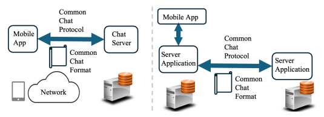

# NLIP Reference Architecture

## 1 Two Complementary Halves  

| Left-hand side – *consumer channel* | Right-hand side – *B2B / service mesh* |
|------------------------------------|-----------------------------------------|
| **Single chat-enabled client** (mobile or desktop) talks to any business chat-server through a **Common&nbsp;Chat Protocol** and **Common Chat Format**. | **Server applications** (each with its own AI / service logic) talk to one another over that *same* protocol and format. |
| Network is treated as a generic transport layer; protocol bindings (REST/HTTPS, gRPC, QUIC, WebRTC, …) can be swapped beneath the NLIP layer. | Enables service composition, data-exchange, federation and chaining of specialised LLM-based agents. |

## 2 Key Architectural Elements & Flows

| Element | Role in the architecture |
|---------|--------------------------|
| **Chat Client (mobile / desktop)** | *Presents a unified natural-language interface.* May be a standalone “super-app” **or** an SDK embedded in other apps. Can embed its own local LLM **or** simply relay text/voice/images to a remote server LLM. |
| **Common Chat Protocol** | Wire-level “grammar” for requests, responses, streaming chunks, auth tokens, policy handshakes, etc. Transport-agnostic: implemented once, bound many times. |
| **Common Chat Format** | Canonical JSON-based envelope that carries • natural language text • multimodal blobs (images, audio, video) • structured sub-messages (URIs, code, policies, tokens). |
| **Chat Server / Server App** | Hosts one or more LLMs plus business logic & data stores. Interprets NLIP messages, enforces auth/authz, applies policy, stores context, generates responses. |
| **Edge / Personal LLM (optional)** | User-controlled agent running locally: filters, summarises, masks or augments NLIP traffic before/after it reaches the network. |

## 3 Supported Deployment Patterns

1. **Classic client–server** – mobile app ↔ business chat-server.  
2. **Proxy / Gateway** – NLIP shim converts legacy REST/proprietary APIs into NLIP.  
3. **Federated / Chained services** – server acts as NLIP client to other NLIP or proxied services; orchestrates multiple LLMs.  
4. **Edge-mediated privacy** – user-side LLM vets or rewrites messages before forwarding, giving users full data control.  

## 4 Why This Matters

* **One app vs. many** – users install *one* NLIP-capable client instead of dozens of siloed apps.  
* **Hot extensibility** – businesses add new capabilities server-side; no client redeploy.  
* **B2B synergy** – enterprises chain agents to create composite offerings (e.g. hotel-bot calls ride-share-bot).  
* **User sovereignty** – modality-agnostic, conversation-aware design lets users (or their local AI) filter, annotate or redact content before it is stored or forwarded.  

> NLIP separates **how we connect** (protocol & format) from **what we do** (business logic, UI, LLM choice), allowing the ecosystem to evolve rapidly without becoming a patchwork of incompatible chat technologies.

# Requirements

In order to be useful, NLIP needs to satisfy several requirements. Some may seem obvious, but we err on the side of caution and list them comprehensively.

## Security

A key requirement for the wide deployment of any protocol is proper security mechanisms.

NLIP must support mechanisms for:

- **Authentication**: The client of NLIP needs to be authenticated by the server. Support must cover all commonly used authentication mechanisms.
- **Authorization**: An authenticated client may only be authorized to send a subset of interactions. Mechanisms must restrict unauthorized requests.
- **Encryption**: Support for current and future secure encrypted communication mechanisms, typically via underlying protocols.

### Identity Management

- Digital identity typically begins with a unique login name.
- Identity may be provided by the service provider or by third-party identity providers.
- NLIP must support users having multiple digital identities and the ability to operate anonymously if required.

## Privacy and Policy Support

To enable trust in NLIP-based interactions, NLIP must support exchange of privacy and policy information:

- **Data Privacy**: Mechanisms must exist to communicate and agree upon data privacy policies.
- **Regulatory Compliance**: Mechanisms must support declarations and agreements of compliance with local jurisdictions and regulations.
- **Attribute Disclosure**: Mechanisms must define what identity-related attributes (e.g., location, legislative authority) are disclosed and agreed upon by parties.

## Anonymous Mode

NLIP must support a mode where users access services without authentication. Businesses may expose public data (e.g., prices, schedules, agendas) without requiring login credentials.

## Multi-Modality

NLIP must support multiple modalities beyond text, including:

- Images (e.g., check deposit)
- Documents (e.g., tax forms, account statements)
- Video-based interactions (for accessibility)
- Sensor data, GPS coordinates, and other domain-specific formats

This requires support for:

- Encoding multiple content types
- Real-time performance (e.g., WebRTC, video chat)
- Accessibility and sentiment analysis features

## Session Management

NLIP must support multiple simultaneous sessions ("chats"), each forming part of a larger "conversation." Features include:

- Identifiers for each session
- A conversation state that includes participants, language, timestamps, and history
- Optional limits on history for memory or performance
- Support for headless sessions (e.g., agent-to-agent interactions)

## Multiple Underlying Protocols

While NLIP will be initially built on HTTPS and JSON, it must also support:

- REST
- QUIC
- gRPC
- WebRTC
- Websockets
- ZeroMQ

Bindings to these protocols must be specified so NLIP can evolve with the ecosystem.

## Multi-Platform

NLIP must not assume any particular hardware or language. It must be:

- Cross-platform (Linux, Windows, Mac, mobile OSes)
- Language-agnostic (supporting C/C++, Go, Java, Python, JavaScript, Rust, etc.)

## Performance

NLIP must support high-performance, low-latency interactions through:

- **Caching of Context**: Store interaction history locally to reduce transmission.
- **Rate Controls**: Allow specification of limits on context size, message length, and request rates to prevent abuse.
- **Denial of Service Prevention**: Design must include safeguards against common DoS vectors (e.g., SYN floods, half-open sessions).
- **Real-time Streaming**: Sessions may be split into multiple prioritized streams with delay and ordering constraints.

## Use Cases

- Universal travel assistant interacting with transit systems across cities.
- Financial transactions across different banking agents.
- Retail shopping and customer service via a common chat interface.
- Conference support agents that guide users through event logistics.

## Stakeholders

- ECMA Technical Committee 56
- AI platform providers
- App developers and platform integrators
- Enterprises seeking to streamline customer interactions

## Benefits

- Simplified user experience through a unified interaction layer.
- Reduced development and maintenance burden for service providers.
- Enhanced security and privacy controls within conversational interfaces.
- Greater adaptability and innovation through flexible, extensible architecture.

## Key Concepts

- **Agents** – Software systems that use NLIP to communicate
- **Messages** – JSON objects with rich content (text, audio, location, etc.)
- **Control exchanges** – Used to negotiate authentication, policies, session management
- **Binding** – NLIP messages can be sent over different protocols (e.g., HTTPS, gRPC)

## Goals

- Support **multi-modal data** (text, audio, structured data)
- Define clear **security and identity negotiation** mechanisms
- Be **extensible** without breaking older clients

## Use Cases

- Universal travel assistant interacting with transit systems across cities.
- Financial transactions across different banking agents.
- Retail shopping and customer service via a common chat interface.
- Conference support agents that guide users through event logistics.

## Stakeholders

- ECMA Technical Committee 56
- AI platform providers
- App developers and platform integrators
- Enterprises seeking to streamline customer interactions

## Benefits

- Simplified user experience through a unified interaction layer.
- Reduced development and maintenance burden for service providers.
- Enhanced security and privacy controls within conversational interfaces.
- Greater adaptability and innovation through flexible, extensible architecture.

## Key Concepts

- **Agents** – Software systems that use NLIP to communicate
- **Messages** – JSON objects with rich content (text, audio, location, etc.)
- **Control exchanges** – Used to negotiate authentication, policies, session management
- **Binding** – NLIP messages can be sent over different protocols (e.g., HTTPS, gRPC)

## Goals

- Support **multi-modal data** (text, audio, structured data)
- Define clear **security and identity negotiation** mechanisms
- Be **extensible** without breaking older clients
